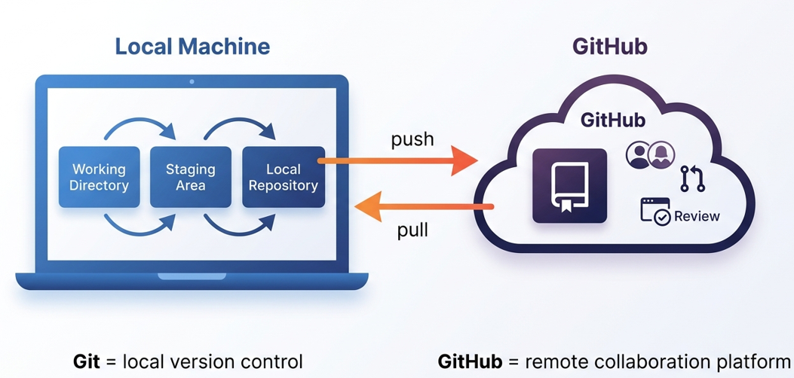
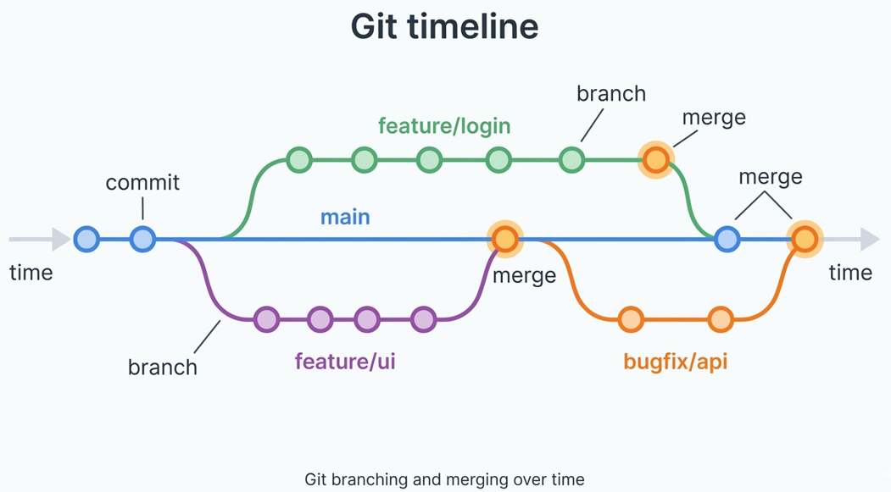

# 📘 Git Command Reference

Ce dépôt présente de manière claire les concepts fondamentaux, les commandes essentielles et les workflows couramment utilisés en gestion de version, en s’appuyant sur les bonnes pratiques de l’industrie.

Il aborde également des aspects clés tels que l’utilisation du fichier .gitignore pour maintenir un dépôt propre, ainsi que la configuration de l’authentification SSH afin de simplifier et sécuriser les connexions.

\---

## 📚 Table des matières (Les grands titres)

- [🆚 Git vs GitHub](#-git-vs-github)
- [🔄 Cycle de travail Git](#-cycle-de-travail-git)
- [🟢 Préparation de l’environnement](#-préparation-de-lenvironnement)
- [🛠️ Initialiser un dépôt Git (2 options)](#️-initialiser-un-dépôt-git-2-options)
- [📊 Voir l’état du dépôt](#-voir-létat-du-dépôt)
- [🔗 Connecter un dépôt local à GitHub](#-connecter-un-dépôt-local-à-github)
- [➕ Ajouter des fichiers à l’index (staging)](#-ajouter-des-fichiers-à-lindex-staging)
- [💾 Enregistrer les modifications (commit)](#-enregistrer-les-modifications-commit)
- [🚫 .gitignore : ignorer les fichiers inutiles](#-gitignore--ignorer-les-fichiers-inutiles)
- [🕒 Consulter l’historique des commits](#-consulter-lhistorique-des-commits)
- [↩️ Annuler des changements](#️-annuler-des-changements)
- [🗑️ Supprimer et restaurer des fichiers](#️-supprimer-et-restaurer-des-fichiers)
- [🌿 Branches et fusions](#-branches-et-fusions)
- [⚔️ Gérer les conflits de fusion](#️-gérer-les-conflits-de-fusion)
- [🧭 Naviguer dans l’historique et comparer](#-naviguer-dans-lhistorique-et-comparer)
- [🩺 Diagnostiquer la configuration Git](#-diagnostiquer-la-configuration-git)
- [🌐 Travailler avec les dépôts distants](#-travailler-avec-les-dépôts-distants)
- [📦 Mettre du travail de côté avec stash](#-mettre-du-travail-de-côté-avec-stash)
- [⏪ Annuler un commit avec git revert](#-annuler-un-commit-avec-git-revert)
- [🤝 Collaborer avec les Pull Requests](#-collaborer-avec-les-pull-requests)
- [🔑 Configurer une connexion SSH](#-configurer-une-connexion-ssh)
- [🧹 Nettoyer les clés SSH](#-nettoyer-les-clés-ssh)
- [📥 Cloner avec une identité spécifique](#-cloner-avec-une-identité-spécifique)
- [🔐 Git Credential Manager](#-git-credential-manager)
- [🧠 Rappels rapides](#-rappels-rapides)
- [📄 Licence](#-licence)

\---

## 🆚 Git vs GitHub
**Git** est un système de gestion de versions.  
Il enregistre l'historique de vos fichiers localement, ce qui permet de :
* suivre chaque modification ;
* conserver plusieurs versions d'un projet ;
* revenir a un état précèdent si nécessaire.

**GitHub** est une plateforme en ligne d'hébergement de dépôts Git. Mais il existe également d'autres plateformes.
Elle sert de point central pour :

* sauvegarder un dépôt a distance ;
* partager le code ;
* collaborer ;
* faire relire et fusionner des changements.

### Définition simple


* **Git** = l'outil local de versioning
* **GitHub** = la plateforme distante de collaboration

\---

## 🔄 Cycle de travail Git

En résumé :

1. Vous travaillez dans votre **working directory** (répertoire de travail local).
2. Vous **staging** vos changements.
3. Vous **commit** ces changements dans votre dépôt local.
4. Facultativement, vous **push** vers un dépôt distant pour sauvegarder ou partager.

### Schéma mental


`Working Directory -> Staging Area -> Local Repository -> Remote Repository`

\---

## 🟢 Préparation de l’environnement

[Installer Git](https://git-scm.com/install/)

### Vérifier l'installation
Ouvre un terminal puis execute la commande ci-dessous pour vérifier que Git est bien installé. La commande `git -v` fonctionne également. Si la version de Git est affichée, Git est installé correctement. Sinon, installez Git en suivant les instructions sur le site officiel de Git. Pour voir l'aide `git -h`.

```bash
git --version
```

> Supposons que t'es dans un répertoire sur l'explorateur Windows, alors tu peux ouvrir un terminal au choix directement positionner à cet emplacement, en utilisant la combinaison des touches (`Shift` + `Clic droit`). 

### Créer un repertoire de projet 
Ouvre le terminal positionné dans ce répertoire du projet. Sur Windows, ouvre le terminal (`Git Bash`) ce qui apportera l'avantage d'utiliser des commandes Unix/Linux comme `touch`, `ls -la`, `ssh-copy-id`, etc, ou encore l'affichage de la branche dans laquelle on se trouve.

Avant de commencer à utiliser Git, il est important de définir ton identité (nom et email).  
Ces informations seront stockées localement sur ton ordinateur et seront associées à tes commits comme signature. 
> Non, **ce n’est pas obligatoire** que l'identité (nom et email) soit celui de ton compte Github. Mais tes commits ne seront pas liés à ton profil GitHub *(pas de badge, contributions, etc.)*.  
> Pour que tes commits soient correctement associés à ton compte GitHub, utilise **le même email** que celui de ton compte GitHub ou un email secondaire/verifié sur GitHub.

### Configurer un utilisateur global
```bash
git config --global user.name "Sympa"
git config --global user.email "sympa@gmail.com"
```
> * Définit l’identité **par défaut** pour tous les projets sur ta machine  

### Configurer un utilisateur local (par projet)
```bash
git config --local user.name "Matt"
git config --local user.email "matt@entreprise.net"
```
> * Définit une identité **spécifique à un projet**  
> * Prioritaire sur la configuration globale  
> * Utile pour séparer projets perso et pro

### Vérifier la configuration 
Affiche toutes les configurations actives (globales + locales)
```bash
git config --list
```
Pour voir uniquement le global :
```bash
git config --global --list
```
Pour voir uniquement le local (dans un projet) :
```bash
git config --local --list
```

## 🛠️ Initialiser un dépôt Git (2 options)

### Option 1 : Initialiser Git dans le répertoire du projet 
Cette commande initialise un dépôt Git dans le répertoire courant.
```bash
git init
```
> **Détails rapides :**
> * crée un dossier caché `.git`
> * permet de commencer à suivre les fichiers avec Git
> **Résultat** : ton dossier devient un projet versionné avec Git.

Pour vérifier le résultat :

```bash
ls -la
```

### Option 2 : Cloner un dépôt Git distant 
Pour cette pratique, rends-toi dans ton compte Github (créez-en sinon), puis créer un nouveau `Repositorie`, ensuite copie l'URL de ton dépôt pour le cloner. 

```bash
git clone https://github.com/6net7/todo-app.git
```
> Cette commande télécharge une copie complète d’un dépôt distant sur ta machine.  
> * `git clone` → récupère le projet  
> * URL → dépôt **todo-app** du compte ***6net7*** sur GitHub  
> **Résultat** : un dossier `todo-app` est créé avec tout l’historique du projet.

Accède au répertoire du projet cloné et affiche son contenu :
```bash
cd todo-app
ls -la
```
> * `cd todo-app` → se déplacer dans le dossier du projet  
> * `ls -la` → afficher tous les fichiers (y compris cachés) avec leurs détails.

À partir de là, tu peux commencer à manipuler des fichiers :
```bash
touch README.md
echo "Hello world !" >> README.md
mkdir fortest
cd fortest
touch README2.md
echo "Hello world !" >> README2.md
```
> Explications  
> * `touch README.md` → crée un fichier vide (ou met à jour sa date)  
> * `echo "Hello world !" >> README.md` → ajoute du texte à la fin du fichier  
> * `mkdir fortest` → crée un nouveau dossier  
> * `cd fortest` → entre dans ce dossier  
> * `touch README2.md` → crée un second fichier  
> * `echo "Hello world !" >> README2.md` → ajoute du contenu dans ce fichier  
>💡 Bon à savoir :   
> * ajoute du contenu sans effacer l'existant  
> * remplace complètement le contenu du fichier

\---

## 📊 Voir l’état du dépôt

```bash
git status
```
> Détails rapides :  
> * montre les fichiers modifiés, ajoutés ou non suivis  
> * indique si des changements sont prêts à être commit  
> * précise la branche actuelle  
> **Résultat** : tu sais exactement ce qui a changé dans ton projet.

\---

## 🔗 Connecter un dépôt local à GitHub
Il est nécessaire d’associer le dépôt local à un dépôt distant afin de pouvoir y héberger le code source et faciliter la collaboration.

Pour établir cette connexion, on utilise la commande suivante :

```bash
git remote add origin https://github.com/6net7/todo-app.git
```
> * `git remote add` → enregistre un dépôt distant  
> * `origin` → nom donné à ce dépôt (par convention, le principal)  
> * `https://github.com/6net7/todo-app.git` → adresse du dépôt sur GitHub  
> **Résultat** : ton projet local sait maintenant où envoyer (`push`) ou récupérer (`pull`) du code, comme on le verra plus tard dans ce guide.

Lister les branches de ton dépôt Git :

```bash
git branch
```
> Détails rapides :  
> * affiche toutes les branches locales  
> * met en évidence la branche actuelle (avec `*`)  
> **Résultat** : tu vois sur quelle branche tu travailles et les autres disponibles.

Lors de l'initialisation locale, la branche principale peut se nommer `master` au lieu de `main`.  
Si besoin, renomme la branche principale en `main` :

```bash
git branch -M main
```
> **Détails rapides :**  
> * `-M` → force le renommage (même si `main` existe déjà)  
> * `main` → nouveau nom de la branche  
> **Résultat** : ta branche active s’appelle maintenant main.  
> **Note :**  
> Pour définir `main` comme nom de branche principale par défaut, utilise :  
> `git config --global init.defaultBranch main`

\---

## ➕ Ajouter des fichiers à l’index (staging) 
Avant de faire un commit, il faut ajouter les modifications à la zone de staging (index) avec `git add` .

### Ajouter tous les changements 
```bash
git add -A
```
ou
```bash
git add --all
```
> 💡 `--all` et `-A` sont équivalents. Ces deux commandes font la même chose.  
> Ajoutent ***toutes les modifications*** du projet à l’index (staging) :  
> * fichiers modifiés  
> * nouveaux fichiers  
> * fichiers supprimés  
> **Résultat** : tout est prêt à être commit.

### Ajouter les changements à partir du dossier courant
Ajoute les modifications du **répertoire courant et ses sous-dossiers** à l’index.
```bash
git add .
```
> * `.` → dossier courant (et ses sous-dossiers)  
> * Inclut : fichiers ajoutés, modifiés et supprimés  
> **Résultat** : les changements locaux dans ce dossier sont prêts à être commit.  
> 💡 Différence avec `git add -A` : `git add .` est limité au dossier courant, alors que `-A` agit sur tout le dépôt.

### Ajouter uniquement les fichiers visibles (sans les suppressions)
Cette commande ajoute des fichiers, mais **pas de la même façon que** `git add .`
```bash
git add *
```
> Détails rapides :
> * `*` est interprété par le *shell* (pas par Git)  
> * Il correspond à ajouter les fichiers visibles (*nouveaux* et *modifiés*) du dossier courant  
> * N’inclut pas les fichiers *supprimés* et *cachés* (comme `.env`)  
> **Résultat** : seuls certains fichiers sont ajoutés, pas forcément tous.  
> 💡 En pratique, préfère `git add .` ou `git add -A` , plus fiables.

### Ajouter un fichier précis à l’index.
Cette commande permet de cibler précisément ce que tu veux versionner.
```bash
git add fichier.txt
```
ou
```bash
git add emplacement/vers/monFichier.txt
```
> Détails rapides :  
> * `fichier.txt` → ajoute ce fichier uniquement  
> * `emplacement/vers/monFichier.txt` → ajoute un fichier spécifique dans un dossier  
> **Résultat** : seuls les fichiers ciblés sont prêts à être commit.

### Ajouter des fichiers par extension
Cette commande ajoute **tous les fichiers** se terminant par `.py` du dossier courant uniquement.
```bash
git add *.py
```
> * ne prend pas les fichiers dans les sous-dossiers, les fichiers supprimés  
> * ignore les fichiers cachés  
> **Résultat** : tous les fichiers `.py` visibles du dossier courant sont prêts à être commit.  
> **💡 Bonnes pratiques :**  
> * Utilise `git status` avant/après un `git add` pour vérifier ce qui est staged  
> * Privilégie `git add -A` pour éviter les oublis (notamment les suppressions)  
> * Évite `git add *` si tu n’es pas sûr de son comportement dans ton environnement

\---

## 💾 Enregistrer les modifications (commit)
Une fois les fichiers ajoutés à la zone de staging (`git add`), tu peux enregistrer un instantané (snapshot) du projet avec un commit.

```bash
git commit -m "Add login feature" 
```
> * `git commit` → enregistre les modifications dans l’historique Git  
> * `-m` → permet d’ajouter un message descriptif  
> * `"Add login feature"` → message décrivant le commit  
> **Résultat** : les fichiers ajoutés (git add) sont sauvegardés dans l’historique du projet avec ce message.

\---

## 🚫 .gitignore : ignorer les fichiers inutiles
Imagine ton projet comme un bureau de travail.

Tu as :
- des documents importants (ton code)
- des brouillons (tests, logs)
- des fichiers perso (config locale, secrets, clés API)

👉 Git, lui, surveille déjà tout ce qui est dans ton dépôt.

Mais toi, tu ne veux PAS tout partager.

C’est là que `.gitignore` entre en scène.

### 🧠 Son rôle (simple et puissant)
👉 `.gitignore` dit à Git :
> “Ignore ces fichiers, ne les suis pas, ne les envoie jamais.”

Il est essentiel pour éviter de versionner :
  - des fichiers temporaires
  - des dépendances volumineuses
  - des données sensibles

### 📜 Exemple concret (très réaliste)
Imaginer un projet Node.js :

Tu va créer le fichier `.gitignore` :
```bash
touch .gitignore
```

Puis tu ajoutes simplement les fichiers ou dossiers que tu ne veux pas versionner. 
(ceci est un extrait d'exemple concret) :
```text
# dépendances installées automatiquement (inutile à versionner)
node_modules/

# environnement → contient des secrets (clés API, mots de passe)
.env

# fichiers générés (build)
dist/

# système macOS → fichiers cachés
.DS_Store

# logs → fichiers de débogage
*.log
```

⚠️ Important :
`.gitignore` n’efface pas les fichiers déjà suivis par Git, il les empêche seulement d’être ajoutés à l’avenir.

Si un fichier a déjà été ajouté à Git, `.gitignore` ne suffit pas.  
👉 Il faut le retirer du suivi :
```bash
git rm --cached fichier
```

### 📌 Conseils pratiques 
Avant chaque commit, demande-toi :
* “Est-ce que ce fichier doit vraiment être public ?”
* Si non → `.gitignore` 

\---

## 🕒 Consulter l’historique des commits
Git permet de visualiser l’historique des modifications du projet.

### Historique complet
```bash
git log
```
> Affiche tous les commits avec :  
> * l’identifiant (hash)  
> * l’auteur  
> * la date  
> * le message du commit

### Historique compact
```bash
git log --oneline
```
> * Affiche chaque commit sur une seule ligne  
> * Très utile pour une vue rapide de l’historique

### Historique compact avec statut des fichiers
```bash
git log --oneline --name-status
```
> Affiche :  
> * les commits en version courte  
> * les fichiers modifiés dans chaque commit  
> * le type de modification (`A` = ajout, `M` = modification, `D` = suppression)

### Historique compact avec graphique des branches 
```bash
git log --graph --oneline --all
```
> Donne une vue graphique des branches et commits sous forme d’arbre et permet de voir facilement où se trouvent les commits.  
> * `git log` → montre l’historique des commits  
> * `--oneline` → 1 ligne par commit (résumé)  
> * `--graph`--graph → affiche une représentation en branches (ASCII)  
> * `--all` → montre toutes les branches  
> Utilise `q` pour quitter l’affichage de `git log` si necessaire.

\---

## ↩️ Annuler des changements
Supossons que vous avez fait des modifications sur des fichiers qui ne sont pas encore commitées et que vous voulez les annuler.
Git permet d’annuler facilement des modifications, que ce soit dans les fichiers ou dans la zone de staging.

### Restaurer un fichier modifié
Ces commandes annulent les modifications locales des fichiers non committées.
```bash
git restore index.html
# ou un dossier entier
git restore folder/
```
> * `git restore index.html` → remet `index.html` dans l’état du dernier commit  
> * `git restore folder/` → restaure tous les fichiers du dossier `folder/`  
> * supprime les changements **non commités**  
> **Résultat** : les fichiers reviennent à leur version du dernier commit enregistrée dans Git.  
> ❗ Attention : les modifications locales non committées sont perdues. *(action irréversible)*

### Annuler toutes les modifications dans le répertoire courant.
```bash
git restore .
```
> * ` . ` → tous les fichiers du dossier actuel (et sous-dossiers)  
> * remet les fichiers à l’état du dernier commit  
> * ne touche pas aux fichiers non suivis (untracked)  
> **Résultat** : tu récupères une version propre du projet, comme au dernier commit.  
> ⚠️ Attention : les changements non commités sont supprimés. *(action irréversible)*

### Retirer un fichier de la zone de staging
Cette commande enlève un fichier de la zone de staging (index), sans supprimer ses modifications.
```bash
git restore --staged fichier.txt
```
> * `--staged` → agit sur les fichiers déjà ajoutés avec `git add`  
> * `fichier.txt` → fichier concerné  
> * les changements restent dans ton dossier, mais ne seront pas commités  
> **Résultat** : le fichier est “désajouté” du prochain commit, mais les modifications dans le fichier sont conservées.

### Retirer tous les fichiers de la zone de staging
Cette commande retire **tous les fichiers du staging area** (zone d’index).
```bash
git restore --staged .
```
> * `--staged` → agit sur les fichiers déjà ajoutés avec `git add`  
> * ` . ` → tous les fichiers du répertoire courant (et sous-dossiers)  
> * ne supprime pas les modifications locales  
> **Résultat** : rien ne sera inclus dans le prochain commit, mais les modifications restent présentes dans les fichiers.

### Revenir à un état non stagé (équivalent global)
Cette commande retire juste les fichiers de la zone de staging (index), sans supprimer les modifications locales.
```bash
git reset
```
> * annule l’effet de `git add`  
> * garde les changements dans tes fichiers  
> * par défaut agit comme `git reset HEAD`  
> **Résultat** : tes fichiers restent modifiés, mais ne sont plus prêts à être commités.

### Revenir au commit précèdent tout en gardant les changements
Cette commande retire les fichiers de la zone de staging (index).
```bash
git reset HEAD
```
> * `HEAD` → dernier commit actuel  
> * annule l’effet de `git add`  
> * conserve les modifications dans les fichiers  
> **Résultat** : les fichiers ne sont plus prêts à être commités, mais ton travail n’est pas perdu.  
> 💡 Équivalent à `git restore --staged .` (plus explicite).

📌 À retenir :
* `git restore` agit sur les fichiers (contenu et/ou staging) et peut supprimer les modifications locales.
> peut être **destructif** (sans`--staged`)
* `git reset` agit principalement sur la zone de staging
> est **vraiment destructif** (avec `git reset --hard`) : **efface tout** (staging + modifications locales)
* Toujours vérifier avec `git status` pour vérifier l'état de tes fichiers avant d’annuler des changements.

\---

## 🗑️ Supprimer et restaurer des fichiers
Supposons que tu as des fichiers ou dossiers qui ne sont plus nécessaires.  
Git permet de supprimer des fichiers tout en contrôlant précisément leur état (suivi, staging, historique).
Cette section reprend des commandes déjà présentés précédement, pour illustrer ces concepts.

### Supprimer un fichier et indexer la suppression
```bash
git rm hello.txt
```
> * Supprime le fichier du disque.  
> * La commande `git rm` enregistre la suppression dans l'index (staging area).  
> * Le fichier sera supprimé au prochain commit.

### Forcer la suppression d’un fichier modifié
```bash
git rm -f hello.txt
```
> * Supprime le fichier du disque même s’il contient des modifications non commit.  
> * Utile si Git refuse la suppression classique.

### Retirer uniquement du staging (sans supprimer)
```bash
git reset
```
> * Annule les ajouts (avec `git add`) dans la zone de staging, mais ne supprime pas les fichiers du disque.
> * ❗ Ne restaure pas les fichiers supprimés avec `git rm`

💡 Pour restaurer un fichier supprimé avec `git rm`, utilise `git restore`. 
Restaurer un fichier supprimé avant commit : 
```bash
git restore script.js
```

### Restaurer complètement à un état précédent
```bash
git reset --hard
```
> Réinitialise :  
> * la zone de staging  
> * les fichiers locaux  
> Revient au dernier commit.  
> ⚠️ *Attention* : cette commande efface toutes les modifications locales non committées (irréversible)

### Retirer un fichier du suivi Git (sans le supprimer du disque)
```bash
git rm --cached four.txt
```
> * Supprime le fichier du suivi Git  
> * Le fichier reste présent sur le disque  
> * Pour le supprimer du disque utilisez `git rm four.txt`  

### Supprimer un dossier récursivement
```bash
git rm -r myfolder
```
> * Supprime un dossier et tout son contenu  
> * Ajoute la suppression au staging area  

\---

## 🌿 Branches et fusions
### Pourquoi utiliser des branches ?
Imagine : ton projet fonctionne parfaitement sur la branche `main` ou autres branches.  
Tout est stable, propre, prêt à être utilisé.

Mais tu as une idée. Une nouvelle feature. Un test. Un doute.

👉 Tu pourrais coder directement sur `main`…  
…et risquer de casser ce qui marche déjà.

Ou alors :

👉 Tu crées une branche à partir d'une branche où tout est déjà parfait (ex: `main`).

Cette nouvelle branche reprendra l’état actuel du projet, dans laquelle tu expérimentes librement, tu casses, tu testes, tu recommences — **sans jamais toucher à la version stable**.

Si ton idée est bonne → tu merges.  
Sinon → tu supprimes la branche. Aucun impact.

💡 **TL;DR**
- *`main`* = version stable  
- nouvelle branche = terrain de jeu sans risque  
- tu merges seulement quand c’est prêt  

### Créer une branche et basculer vers elle
Une nouvelle branche reprend **exactement l’état de la branche active** au moment de sa création.
La création d'une nouvelle branche est rapide. 
```bash
git branch frontend
```
> * Crée une nouvelle branche nommée `frontend` sans basculer vers elle.  

Basculer vers la nouvelle branche `frontend` :
```bash
git checkout frontend
```
> Alternative `git switch frontend`

Créer une branche et basculer immédiatement en une seule commande :
```bash
git checkout -b develop
```
> Alternative `git switch -c develop`

### Voir les branches
```bash
git branch
```
> Liste les branches locales.  
> L’astérisque `*` indique la branche active.

### Fusionner des branches (merge)
La fusion combine les modifications de deux branches. 
La fusion est généralement réalisée sur la branche active.

Supposons que vous ayez créé une nouvelle branche nommée `frontend`. Vous avez travaillé dessus et tout semble parfait. Vous êtes prêt à intégrer les modifications de cette branche dans la branche principale `main`.  

Alors, basculez sur la branche `main` :
```bash
git checkout main
```
Ensuite, importer les changements de la branche `frontend` dans `main` :
```bash
git merge frontend
```
> * Fusionne l’historique des deux branches.  
>  **Résultat** : ta branche actuelle `main` est mise à jour avec le contenu de `frontend`.  
> * En cas de conflit, Git te demandera de les résoudre manuellement (Sujet abordé plus loin dans ce guide).  

On peut aussi faire l'inverse. 
Par exemple, en cas de changemennt dans la branche `main`, vous pouvez basculer sur la branche `frontend` et faire un *`merge`* de la branche `main` dans `frontend`.
```bash
git checkout frontend
git merge main -m "import changes from main into frontend"
```
> * `git checkout frontend` → bascule dans la branche `frontend`  
> * `git merge main` → récupère les changements de `main`  
> * `-m "..."` → ajoute un message de commit pour cette fusion.  
> **Résultat** : ta branche actuelle `frontend` est mise à jour avec le contenu de `main`.

### Supprimer une branche locale
```bash
git branch -d nom_de_la_branche
```
> * Supprime une branche **uniquement si elle est déjà fusionnée**

### Forcer la suppression d’une branche non fusionnée
```bash
git branch -D nom_de_la_branche
```
> * Supprime même si la branche contient des changements non fusionnés.  
> ❗ Risque de perte de travail si la branche n'est pas fusionnée.

### Supprimer une branche sur le dépôt distant
```bash
git push origin --delete nom_de_la_branche
```
> * `git push` → envoie des actions vers le dépôt distant  
> * `origin` → nom du dépôt distant  
> * `--delete nom_de_la_branche` → demande la suppression de cette branche à distance  
> **Résultat** : la branche est supprimée du serveur (ex : sur GitHub).

\---

## ⚔️ Gérer les conflits de fusion

Tu travailles tranquillement sur ta branche.  
Quelqu’un (ou toi, ailleurs) modifie les **mêmes lignes** dans le même fichier.

Tu merges… et là 💥 **Conflit.**

Git s’arrête.  
Pas d’erreur. Pas de bug. Juste une question :  
👉 *“Quelle version veux-tu garder ?”*

### 🧩 À quoi ça ressemble ?

Dans le fichier, tu verras :

```txt
<<<<<<< HEAD
ta version
=======
autre version
>>>>>>> main
```
> 👉 À toi de décider :  
> * garder ta version  
> * garder l’autre  
> * ou combiner intelligemment les deux

### Résolution (simple et rapide)
1. Ouvre le fichier en conflit,
2. Modifie le contenu (supprime les marqueurs `<<<<<<<`, `=======`, et `>>>>>>>`)
3. Sauvegarde le fichier.
4. Ajoute le fichier : `git add fichier.exp`
5. Finalise : `git commit`

💡 TL;DR
* Conflit = mêmes lignes modifiées  
* Git ne choisit pas à ta place  
* Tu décides, tu nettoies, tu commit

\---

## 🧭 Naviguer dans l’historique et comparer
Ton code ou ton travail a évolué. Beaucoup.  
Mais parfois, tu veux revenir en arrière… comprendre… comparer.

👉 Bonne nouvelle : Git garde **tout en mémoire**.

### Voir les commits (en une ligne) :
```bash
git log --oneline
```
> * Affiche l’historique en version compacte  
> * Chaque ligne = un commit (avec son identifiant)

### Explorer un ancien commit (sans rien casser) :
```bash
git checkout b52a404
```
> * Permet de voir le dépôt à cet instant précis du projet 
> * Tu peux lire, tester, explorer  
> ⚠️ Mais attention : tu n’es plus sur une branche : **`detached HEAD`**  
> Tu peux, soit :  
> * créer une nouvelle branche à partir de cet instant précis: `git switch -c nom_de_la_branche`  
> * revenir à la branche où tu étais: `git switch -`

### Comparer deux commits :
```bash
git diff f0819e3 a81d08a
```
> * Affiche les différences entre deux commits  
> * `f0819e3` et `a81d08a` sont des identifiants de commits.  
> * Tu peux aussi utiliser des noms de branches, comme `git diff main frontend`
👉 **L’ordre change le sens de lecture du diff** :
* `git diff A B` → montre les changements pour transformer **A en B**
* `git diff B A` →  montre les changements pour transformer **B en A**
* inversement des ajouts/suppressions. Ce qui est `+` dans un sens devient `-` dans l’autre.

\---

## 🩺 Diagnostiquer la configuration Git
Un push qui échoue.  
Un dépôt qui ne répond pas.  
Un doute sur ton compte ou ton remote.

👉 Avant de paniquer : **diagnostic rapide.**

### Vérifier l’URL distante actuelle
```bash
git remote -v
```
> * Affiche les dépôts distants liés (`origin` ou `upstream`)  
> * Tu vois où ton code est envoyé.

### Ajouter une URL distante (remplacer par votre propre URL)
Lie ton projet local à un dépôt distant.

```bash
git remote add origin https://sympa@github.com/6net7/todo-app.git
```
> `https://sympa@github.com/...`  
>  → spécifie un nom d’utilisateur (sympa) pour la connexion  
>  → Git saura quel compte utiliser (utile si plusieurs comptes)
OU utiliser simplement :
```bash
git remote add origin https://github.com/6net7/todo-app.git
```
> `https://@github.com/...`  
>  → aucun utilisateur précisé  
>  → Git te demandera ton identifiant ou utilisera une config déjà enregistrée.

### Modifier l'URL distante  (remplacer par votre propre URL)
```bash
git remote set-url origin https://github.com/username/repository.git
```
> * Corrige une mauvaise URL  
> * Change de dépôt ou de compte (ex: de GitHub vers GitLab)  
> * spécifier un nom d’utilisateur

### Supprimer une URL distante 
```bash
git remote remove origin
```
> Supprime le lien avec le dépôt distant.

### Passer en SSH (authentification simplifiée)
Utiliser SSH pour une authentification plus simple.
Nécessite d'avoir configur SSH. (Sujet abordé plus loin dans ce guide)
```bash
git remote set-url origin git@github.com:Matrak/repository.git
```
> * Évite de saisir identifiant/mot de passe  
> * Utilise une clé SSH pour l'authentification 

### 👤 Vérifier ou définir l’identité Git utilisée dans les commits
Vérifie le nom et l’email associés à tes commits.  

Affiche (ou définit) ton identité globale Git.
```bash
git config --global user.name
git config --global user.email
```
> * `--global` → s’applique à tous tes projets  
> * `git config --global user.name Bob` → définit le nom d'utilisateur  
> * `git config --global user.email bob@email.com` → définit l'email

Affiche (ou définit) ton identité pour ce dépôt uniquement.
```bash
git config --local user.name
git config --local user.email
```
> * `--local` → spécifique au projet courant  
> * prioritaire sur `--global`  
> * `git config --local user.name Matt` → définit le nom d'utilisateur  
> * `git config --local user.email matt@enterprise.net` → definit l'email

Liste toute la configuration Git actuelle.
```bash
git config --list
```
> * affiche global + local + système  
> * utile pour vérifier ce qui est actif  
>**Résultat** : tu vois exactement quelle configuration Git est utilisée.

\---

## 🌐 Travailler avec les dépôts distants
Ton code est prêt… mais il est encore **local**.  
Pour collaborer, sauvegarder ou déployer → il doit vivre **à distance**.

### Envoyer ses changements (`push`)
En pratique → on push branche par branche.
`git push` → pousse **uniquement la branche courante** (celle sur laquelle tu es).

Par exemple, envoyer la branche `main` vers le dépôt distant et crée un lien de suivi.
```bash
git push -u origin main
```
> * `git push` → envoie les commits  
> * `origin` → dépôt distant  
> * `main` → branche envoyée  
> * `-u` (`--set-upstream`) → associe ta branche locale à la branche distante  
>**Résultat** : la branche `main` est publiée (ex : sur GitHub) et tu pourras ensuite faire simplement `git push` / `git pull` sans préciser *`origin`* ou le *nom de la branche* ou `-u`.

Basculer sur ****une autre branche**** pour l'envoyer aussi au dépôt distant.
```bash
git switch ma-branche
```
```bash
git push -u origin ma-branche
```

### Récupérer les changements distants
Tu reviens sur ton projet…  
Mais pendant ce temps, le dépôt distant a évolué.

Du nouveau code. Des corrections. Peut-être des surprises.

👉 Avant de continuer, tu te synchronises.

Tu récupères les changements… puis tu les fusionnes avec tes propres modifications.
Tu gardes le contrôle total sur ce que tu merges.

```bash
git fetch
```
> → télécharge les changements **sans les appliquer**.

```bash
git merge origin/main
```
> → applique les changements téléchargés dans ta branche.

### Récupérer + fusionner en une seule commande
```bash
git pull
```
> → `git pull` équivaut à : `git fetch` + `git merge`  
> → Plus rapide, mais moins de contrôle.

### Vérifier les branches (locales + distantes)
```bash
git branch -a
```
> * Liste toutes les branches  
> * Inclut les branches distantes (`remotes/origin/...`)

### Tout pousser d’un coup
Cette commande pousse toutes les branches locales vers le remote.
⚠️ à utiliser avec précaution (tu peux envoyer des branches inutiles).
```bash
git push --all
```

\---

## 📦 Mettre du travail de côté avec stash
Tu es en plein milieu d’une tâche…  
Mais tu dois changer de branche. Urgent.

Ton code n’est pas fini. Pas prêt à commit.  
👉 Tu ne veux rien casser.

Alors tu fais une pause. Tu **stash** le travail actuel,  
puis tu changes de branche en toute tranquilité,  
Et en revenant, tu récupères ton travail.

### Sauvegarder temporairement ton travail actuel 
```bash
git stash
```
> * Met de côté les modifications non commitées  
> * Nettoie ton espace de travail

### Restaurer et retirer le stash
```bash
git stash pop
```
> * Récupère les modifications  
> * Supprime le stash après restauration

### Restaurer sans supprimer le stash
```bash
git stash apply
```
> * Restaure le contenu  
> * Conserve une copie dans le stash

### 📚 Voir la liste des stashes
```bash
git stash list
```
> Affiche tous les travaux sauvegardés (`stash@{0}`, `stash@{1}`, …)

### 🎯 Restaurer un stash précis
```bash
git stash pop stash@{0}
# ou 
git stash apply stash@{0}
```
> Cible un stash spécifique

### 🗑️ Supprimer un stash
```bash
git stash drop stash@{0}
```
> Supprime un stash précis

### 🧽 Pour tout nettoyer :
```bash
git stash clear
```

💡 TL;DR
* `stash` → mettre de côté
* `pop` → récupérer + supprimer
* `apply` → récupérer sans supprimer
*  parfait pour changer de branche sans commit

\---

## ⏪ Annuler un commit avec git revert

`git revert` permet de revenir a l'état précédant un commit **en créant un nouveau commit**, sans réécrire l'historique.

```bash
git log --oneline
git revert 0429467
```

\---

## 🤝 Collaborer avec les Pull Requests

Une **Pull Request (PR)**, c’est le moment où ton code quitte ta bulle.

Tu n’écris plus seulement pour toi.  
👉 Tu proposes tes changements au projet.

### 🚀 Le scénario classique

Tu ne touches pas directement à `main`.

1. Tu crées une branche  
2. Tu développes ta feature  
3. Tu pushes sur GitHub  
4. Tu ouvres une Pull Request  

👉 Et là, tu dis au monde :
> “Voilà mon travail. Est-ce qu’on peut l’intégrer à `main` ?”

### 🔍 Ce qui se passe sur GitHub
Dans l’onglet **Pull Requests** :
- **base** → `main` (la destination)  
- **compare** → `feature` (ton travail)

### 🧠 En clair
Une PR, c’est :  
➡️ une demande de fusion  
➡️ + une revue de code  
➡️ + un point de contrôle avant intégration 

💡 **TL;DR**
- branche = ton espace de travail  
- PR = demande officielle de fusion  
- review = validation avant intégration dans `main`  

\---

## 🔑 Configurer une connexion SSH
Tu en as assez de taper ton mot de passe à chaque connexion ?  
👉 Passe en **SSH**. Une clé, et c’est réglé.

### Créer une paire de clés
Génère une clé SSH **sécurisée et moderne (ed25519)**. 
Cette commande crée une paire de clés dans le dossier `~/.ssh/`, exemple :  
* clé privée → `~/.ssh/id_ed25519` (à ne jamais partager)  
* clé publique → `~/.ssh/id_ed25519.pub` 
```bash
ssh-keygen -o -a 100 -t ed25519 -f ~/.ssh/id_ed25519 -C "clé GitHub travail mon@email.com"
```
> Tu seras invité à entrer une passphrase. Cela protège ta clé privée car si quelqu’un la récupère (non protégée) = accès direct sans protection.  
> **Détails rapides :**  
> * `-t ed25519` → type de clé moderne et sécurisé  
> * `-f ~/.ssh/id_ed25519` → emplacement du fichier  
> * `-C "serveur-production"` → sert juste de commentaire (pour identifier la clé)  
> * `-o` → utilise un **format de clé privé moderne** (plus sécurisé)  
> * `-a 100` → niveau de protection de la clé (plus c'est plus fort, plus c'est long à taper). Rend les attaques par brute-force plus difficiles.  
> **Résultat** : une paire de clés (publique + privée) pour t’authentifier, par exemple sur GitHub sans mot de passe.

### Copier la clé publique  
Utilise la commande suivante pour afficher le contenu de la clé publique.  
Linux / Windows (Git Bash / PowerShell) :
```bash
cat ~/.ssh/id_ed25519.pub
```
> 👉 Copie le contenu (ça commence par `ssh-ed25519 ...`) sans le commentaire.

### Ajouter la clé sur GitHub
1. Va sur GitHub
2. Clique sur ta photo → **Settings**
3. **SSH and GPG keys**
4. Clique **New SSH key**
5. Remplis :
    * Title : ex: `mon-laptop`
    * Key Type : Authentication Key
    * Key : colle ta clé publique
6. Clique **Add SSH key**

### Configurer l'agent SSH pour éviter de retaper la passphrase tout le temps
Mettre une passphrase protège ta clé privée mais tu dois la saisir…   
sauf si tu utilises un agent SSH (`ssh-agent`) qui la mémorise.

💡 L’objectif de `ssh-agent` n’est pas la persistance, mais d’éviter de retaper la passphrase pendant que le PC est allumé.  
  ✔️ L’agent peut démarrer automatiquement (si configuré)  
  ❌ Mais il ne garde jamais les clés après redémarrage  
  🔐 Tu devras réentrer la passphrase une fois par session

### 🐧 Configurer l'agent SSH sur Linux 

1. Démarrer l’agent
```bash
eval "$(ssh-agent -s)"
```

2. Ajouter ta clé
```bash
ssh-add ~/.ssh/id_ed25519
```
> Entre ta passphrase une seule fois.

3. (Optionnel mais utile) Auto au démarrage
Ajoute dans `~/.bashrc` ou `~/.zshrc` :
```bash
eval "$(ssh-agent -s)" >/dev/null
```
```bash
ssh-add ~/.ssh/id_ed25519 2>/dev/null
```

Voir les clés actives dans **ssh-agent** :
```bash
ssh-add -l
```

### 🪟 Configurer l'agent SSH sur Windows
✔️ Méthode PowerShell (en tant qu'admin)

1. Activer le service
```bash
Get-Service ssh-agent | Set-Service -StartupType Automatic
```
```bash
Start-Service ssh-agent
```

2. Ajouter la clé
Vérifie ensuite :
```bash
ssh-add $env:USERPROFILE\.ssh\id_ed25519
```
> Entre ta passphrase une seule fois.

Voir les clés actives dans **ssh-agent** :
```bash
ssh-add -l
```

✔️ Git Bash (alternative)
1. Démarrer l’agent
```bash
eval "$(ssh-agent -s)"
```

2. Ajouter ta clé
```bash
ssh-add ~/.ssh/id_ed25519
```

### Tester la connexion SSH
```bash
ssh -T git@github.com
```
> Première fois :  
> * tape **yes** ou **renseigne le mdp** si démandé  
> * tu dois voir un message du type :  
>    → `Hi username! You've successfully authenticated, ...`

### Utiliser SSH pour tes repos GitHub (remplacer l'URL par le votre)
Si ton repo est en HTTPS, change-le en SSH :
```bash
git remote set-url origin git@github.com:6net7/todo-app.git
```
> Résultat  
> * plus besoin de mot de passe GitHub  
> * git push / git pull sécurisés via SSH  
> * clé protégée par passphrase + ssh-agent

\---

[Autres sections supplémentaire]

## 🧹 Nettoyer les clés SSH 

---

### 1. Supprimer une clé générée (fichiers)

```bash id="k1p9xz"
rm ~/.ssh/id_ed25519
rm ~/.ssh/id_ed25519.pub
```

👉 adapte le nom si besoin (`id_ed25519`, etc.)

---

### 2. Retirer une clé de ssh-agent

```bash id="a7v2qm"
ssh-add -d ~/.ssh/id_ed25519
```

👉 ou tout vider :

```bash id="m3x8wp"
ssh-add -D
```

---

### 3. Stopper / reset ssh-agent

#### Linux

```bash id="t9q2lz"
eval "$(ssh-agent -k)"
```

#### Windows (PowerShell)

```powershell id="p4n7xr"
Stop-Service ssh-agent
```

---

### 4. Nettoyage complet (reset “propre”)

```bash id="z8k2mv"
ssh-add -D
rm ~/.ssh/*
```

⚠️ Attention : supprime toutes tes clés SSH.

---

### 🎯 Résumé simple

* `rm ~/.ssh/*` → supprime les clés
* `ssh-add -D` → vide l’agent
* `ssh-agent -k` / `Stop-Service` → coupe l’agent

---

💡 Résultat : environnement SSH totalement propre (comme neuf).

\---

## 📥 Cloner avec une identité spécifique
Lorsque tu clones un dépôt Git distant sur ta machine,  
tu peux inclure ton identité pour dire à Git et Git Credential Manager de l'utiliser pour l'authentification.

Pour cela, utiliser :  
```bash
git clone https://contrib123@github.com/6net7/todo-app.git
```
> `git clone` → télécharge un dépôt  
> `https://contrib123@github.com/...` → utilise l’utilisateur **contrib123** pour l’authentification  
> `6net7/todo-app.git` → dépôt ciblé (projet **todo-app** du compte **6net7** sur GitHub)  
> **Résultat** : tu obtiens une copie locale complète du projet (s'il n'est pas vide).  

Si le dépôt a déjà été cloné avec la commande :

```bash
git clone https://github.com/6net7/todo-app.git
```

tu peux mettre a jour l'URL distante avec la commande :

```bash
git remote set-url origin https://employee9999@@github.com/6net7/todo-app.git
```

\---

## 🔐 Git Credential Manager

Commande source : 
```bash
git credential-manager github --help
```

Informations utiles :

```text
Description:
  Commands for interacting with the GitHub host provider

Usage:
  git-credential-manager github \\\\\\\\\\\\\\\\\\\\\\\\\\\\\\\\\\\\\\\\\\\\\\\\\\\\\\\\\\\\\\\[command] \\\\\\\\\\\\\\\\\\\\\\\\\\\\\\\\\\\\\\\\\\\\\\\\\\\\\\\\\\\\\\\[options]

Options:
  --no-ui         Do not use graphical user interface prompts
  -?, -h, --help  Show help and usage information

Commands:
  list              List all known GitHub accounts.
  login             Add a GitHub account.
  logout <account>  Remove a GitHub account.
```

\---

## 🧠 Rappels rapides

* `git init` initialise un dépôt local.
* `git branch -M main` renomme la branche par défaut en "main".
* `git add .` prépare les changements.
* `git commit -m "Fix navigation bug"` enregistre un snapshot local.
* `git remote add origin https://github.com/6net7/portfolio.git`
* `git push -u origin main` envoie les commits vers le dépôt distant. à faire une seule fois pour chaque dépôt (branche). Puis utiliser simplement `git push`. 
* `git pull` récupère et fusionne les changements distants.
* `git stash` met temporairement des modifications de côté.
* `git revert` annule un commit sans casser l'historique.

\---

## 📄 Licence
[6net7]
Ce dépôt est proposé comme un aide-mémoire pédagogique dédié à Git, GitHub et SSH.  
Il a pour objectif de faciliter l’apprentissage, la révision et l’application des bonnes pratiques en gestion de version.